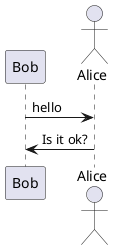
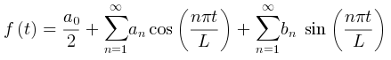

# 前言
本文详细介绍了“如何用hugo**免费**搭建个人博客并自动化发布部署”，

# 絮絮叨
很久

# 需求分析

核心诉求如下：
- 安全性高：对于博
# 技术选型

目

# 后记
恭喜你，看到这里，说明你已经掌握了 用hugo**免费**搭建个人博客并自动化发布部署 的所有技巧！心动不如行动，马上搭建你的BLOG吧！

# 参考
- plantuml官方在线：https://www.planttext.com/
- $$Tex code$$, 块内公式换行问题，请问你们是怎样解决的呢？:https://github.com/flysnow-org/maupassant-hugo/issues/21

- 使用Pandoc和KaTeX为HUGO添加LaTeX支持:https://wrong.wang/flight-rules/20181130-%E4%BD%BF%E7%94%A8pandoc%E5%92%8Ckatex%E4%B8%BAhugo%E6%B7%BB%E5%8A%A0latex%E6%94%AF%E6%8C%81/
- Draw Diagrams With Markdown：https://support.typora.io/Draw-Diagrams-With-Markdown/
- https://mogeko.me/categories/%E6%8A%98%E8%85%BE%E5%8D%9A%E5%AE%A2%E7%9A%84%E4%BA%8C%E4%B8%89%E4%BA%8B/