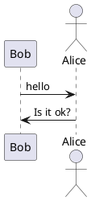

# 前言
本文详细介绍了“如何用hugo**免费**搭建个人博客并自动化发布部署”，

# 絮絮叨
很久

# 需求分析

核心诉求如下：
- 安全性高：对于博
# 技术选型

目

# 后记
恭喜你，看到这里，说明你已经掌握了 用hugo**免费**搭建个人博客并自动化发布部署 的所有技巧！心动不如行动，马上搭建你的BLOG吧！

# 参考
- plantuml官方在线：https://www.planttext.com/