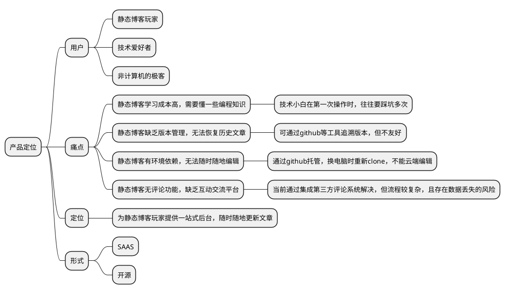
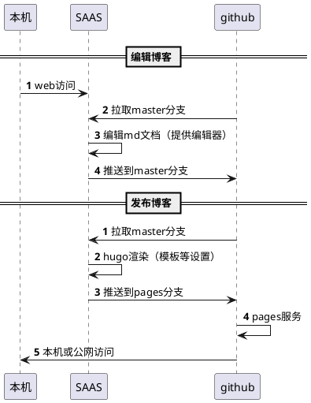

## 前言

近期重建博客，发现用 github 托管 hugo 静态博客无比舒心，满足了服务免费、数据安全、扩展性强等需求。美中不足的是，静态博客无法在线编辑，更换电脑需要单独配置环境，无法在手机上修改文章。我想，肯定不止我遇到了这个难题,不如做个产品解决它。

## 建站经历

大概在 2 年前接触到静态博客，犹记得第一次鼓捣时，无所适从的场景。当时，用静态博客为公司搭建了一个官网，先是了解静态博客的基本架构，然后用命令行创建站点、文章并生成静态文件，最后是手动将站点上传到服务器。整个过程比较繁琐，着实摸索了一些时间。尤其是每次更新文章，都要如此重复一番，令人不爽。后来，更换了一次电脑，官网的数据也不知弄到那里，就只能重新再来一遍。事后无尽懊悔，不该不备份数据。

直到前些天，学会了用 gihub 托管静态网站，才从根本上解决了`自动化部署`和`数据备份`的问题。从学习、爬坑到正式部署，花了将近一天时间。

对于懂技术的同学，若是找不到合适的教程，难免也要像我一样，花费这么长时间。假若建立博客的信心不够坚定，想必也会半途而废，从而失去了建站的乐趣。而不懂技术的同学，即使找到合适的教程，可能也会被`命令行`和`配置步骤`吓到，未必能照葫芦画瓢。

我希望这款产品能够让有志于建立静态博客的小白，无需命令行，仅靠`Next`就能在半小时内学会，并搭建出自己的静态博客。同时，解决掉静态博客无法在线编辑的难题。

## 需求分析

从以上经历可以发现：

**首先**，使用静态博客**最大**的问题是搭建门槛高，尤其是技术门槛，例如`命令行操作`以及`git及GitHub等的使用`。

**其次**，静态博客缺乏版本管理工具，无法像动态博客那样，保留每次修改记录，以便于恢复或追溯。这可能会导致辛苦完成的文章，因没有备份而丢失，损失难以估量。

**此外**，静态博客无法在线（网页）编辑，每次更新内容都要手动执行发布命令。即使采用了自动化部署，也需要人工用命令行把本地仓库 push 到 github 上。而且，采用该方式搭建的静态博客，不支持手机端编辑，而且更换电脑时也需要额外配置环境，如`安装git`、`安装hugo`、`安装编辑器`等。

**另一方面**，静态博客编辑体验存在问题，最为突出的是图片上传。动态博客可以方便拖拽上传图片，而静态博客基于 markdown 语法，图片需要额外的`图床`托管。一般需要先将图片上传到某个`图床`后，把链接复制下来，再粘贴到 markdown 文件中，整个流程比较繁琐。

**最后**，静态博客默认不支持`评论`、`留言`等交互功能，缺乏写文章最大动力：`反馈`。大多数静态博客通过`引入js`的方式解决该问题，但目前来看缺乏安全、可靠的插件或插件平台来解决该问题。

针对上述问题，有如下解决方案：

- **可视化建站流程**：将`命令行操作`以及`git及GitHub等的使用`等复杂操作进行封装，可视将建站及文章发布流程；
- **文章版本追溯及站点发布**：基于 GitHub 或 gitee 托管 markdown 格式的文章，系统自动从指定`文章仓库`下载 markdown 文章，并根据指定的`站点模板`生成站点，自动发布；
- **文章在线编辑并优化编辑体验**：基于 GitHub 或 gitee 提供的 api,访问用户指定的`文章仓库`，在网页中编辑 markdown,并`内置图床`、`公式编辑`、`流程图`等功能；
- **插件及模板市场**：提供插件和模板市场，允许用户在线选购插件或模板，如`评论插件`，复制代码可直接集成到网站中；

通过以上分析，产品定位也很明确了：**静态博客后台管理系统**。

服务形式分为两种：

- 针对无服务器的用户提供 SAAS 化服务方案；
- 针对有服务器的用户提供开源私有化部署方案。

## 竞品分析

上述产品设计，综合借鉴了下述国内外几款产品。国内两款产品主要侧重于`GitHub文件的在线编辑`，国外两款产品侧重于`基于GitHub源的自动化部署`。综合国内外几款产品，将`在线编辑`和`可视化部署`结合起来，可以解决上述大多数问题。

- 国内
  - https://www.jingtaiboke.com/help1.html

 - https://isnowfy.github.io/about-simple-cn.html

- 国外
  - https://glitch.com/dashboard
  - https://vercel.com/dashboard

## 架构设计

考虑到工作量，计划先基于 GitHub 实现 MVP 产品原型，主要分为两个核心功能：`编辑博客`和`发布博客`。

- **编辑博客**：用户打开 web 页面访问 SAAS 系统，SAAS 系统自动从当前用户指定的 github 仓库分支中读取文章，在线编辑后，自动推送到该仓库分支（master);
- **发布博客**：用户点击`发布`按钮时，SAAS 系统自动下载文章，并调用 hugo，根据设置的模板生成站点，自动将站点推送到指定的 github 仓库分支（pages）托管，用户可通过 GitHub 提供的域名访问博客；

## 后续工作

按照上述架构完成最小化 MVP 后，根据反馈优化产品体验：例如针对在线编辑功能，增加标签提取功能、更多的图床；针对发布博客功能，增加更多的托管平台。

@2021-02-08 于长安 Last Modify：2021-02-10

## 参考

- https://www.netlify.com/jamstack/
- https://jamstack.org/headless-cms/
- https://forestry.io/
- https://app.tina.io/quickstart
- https://www.datocms.com/cms/hugo-cms
- https://strapi.io/
