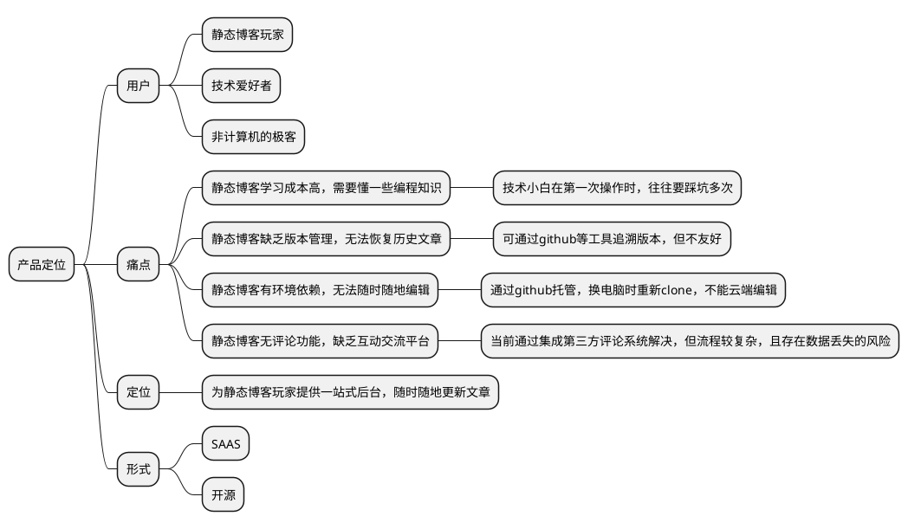
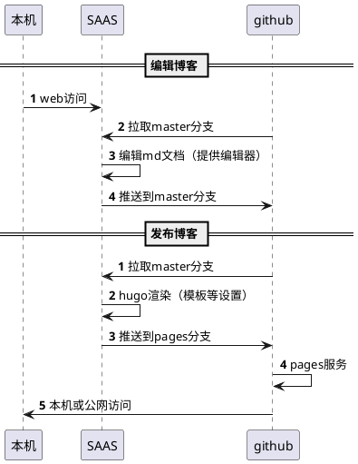

## 前言
近期重建博客，发现用github托管hugo静态博客无比舒心，满足了服务免费、数据安全、扩展性强等需求。美中不足的是，静态博客无法在线编辑，更换电脑需要单独配置环境，无法在手机上修改文章。我想，肯定不止我遇到了这个难题,不如做个产品解决它。

## 建站经历
大概在2年前接触到静态博客，犹记得第一次鼓捣时，无所适从的场景。当时，用静态博客为公司搭建了一个官网，先是了解静态博客的基本架构，然后用命令行创建站点、文章并生成静态文件，最后是手动将站点上传到服务器。整个过程比较繁琐，着实摸索了一些时间。尤其是每次更新文章，都要如此重复一番，令人不爽。后来，更换了一次电脑，官网的数据也不知弄到那里，就只能重新再来一遍。事后无尽懊悔，不该不备份数据。

直到前些天，学会了用gihub托管静态网站，才从根本上解决了`自动化部署`和`数据备份`的问题。从学习、爬坑到正式部署，花了将近一天时间。

对于懂技术的同学，若是找不到合适的教程，难免也要像我一样，花费这么长时间。假若建立博客的信心不够坚定，想必也会半途而废，从而失去了建站的乐趣。而不懂技术的同学，即使找到合适的教程，可能也会被`命令行`和`配置步骤`吓到，未必能照葫芦画瓢。

我希望这款产品能够让有志于建立静态博客的小白，无需命令行，仅靠`Next`就能在半小时内学会，并搭建出自己的静态博客。同时，解决掉静态博客无法在线编辑的难题。

## 需求分析
从我的经历可以发现，使用静态博客最大的问题是搭建门槛高，尤其是技术门槛，例如命令行操作dun'hao

静态博客 , 在线写。
静态博客编辑器,是一个静态博客管理后台,在线写博客工具

在线创建,编辑

文章头、标签、分类快捷键

多种图床方案

微信截图直接上传图床

首先，明确下用户群体

## 竞品分析

- 国内
    - https://www.jingtaiboke.com/help1.html

    - https://isnowfy.github.io/about-simple-cn.html

- 国外
    - https://glitch.com/dashboard
    - https://vercel.com/dashboard

## 架构设计

## 后续工作

