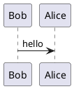

hugo new about.md

一颗种子

逻辑推理+科学技术

+计算机

人口普查

诸子百家 + 春秋战国

机械

必须要受器重 财力支持

战争-》通讯技术

hugo server --theme=hyde --buildDrafts

hugo --theme=hyde --baseUrl="http://anson.github.io/"

./hugo --theme=hyde --baseUrl="https://caoyanbin1993.github.io/blog/"

####

#### 部署记录

git push origin blog

######

1.记得要创建 master 分支：https://www.cnblogs.com/silencey/p/10794784.html

2.记得至监控 blog 分支：
3.git clone 的三个方法：https://www.cnblogs.com/chywx/p/13447056.html
